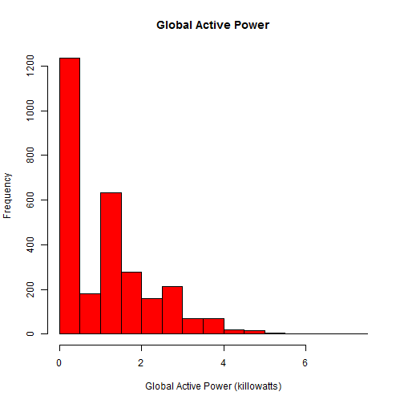
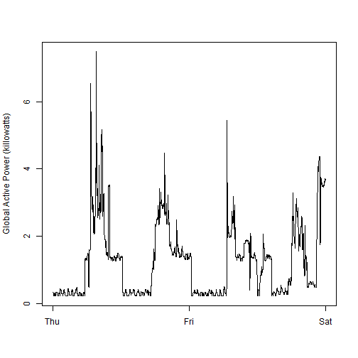
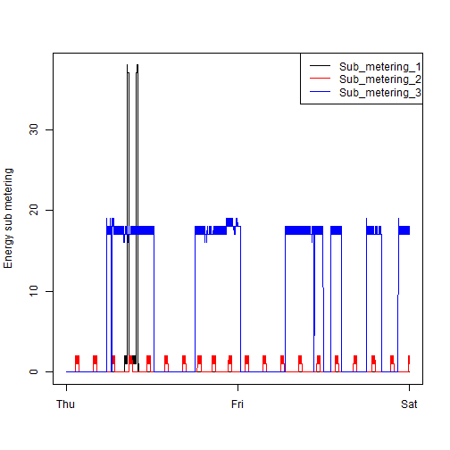
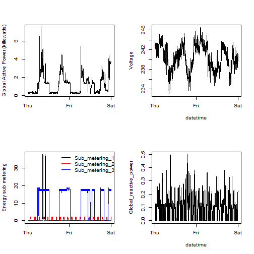

The goal of report is to demo the base graphics functions using the UC Irvine Machine Learning Repository, with the "Individual household electric power consumption" Data set, altered for the coursera assignment 1 for Exploratory Data Analysis, by Roger Peng.  

For this assignment, four plots must be recreated with this data using base graphics, with the code snippets uploaded and the plots as .PNG files uploaded as well, to the github repo.  This report will catalog the entire process, code and plots additionally to the individual snipets and plots.


```r
#Locate and download the data from the w
#setwd("/home/edecambra/github/uci_machine_learn_R/")# retrieving the data
setwd("c:/coursera/uci_machine_learn_R")
if(!file.exists("power_consume.zip")){
url <- "http://d396qusza40orc.cloudfront.net/exdata%2Fdata%2Fhousehold_power_consumption.zip"
#download.file(url, "power_consume.zip", method = "wget") #Linux
download.file(url, "power_consume.zip")# windows
unzip("power_consume.zip")
system("rm power_consume.zip")}

#load data, and decompress
data <- read.table("household_power_consumption.txt", header = TRUE, 
                   sep = ";", na.strings = "?")
data$Time <- strptime(paste(data$Date, data$Time), format = "%d/%m/%Y %H:%M:%S") #time convert
data$Date <- as.Date(data$Date, format = "%d/%m/%Y")  #date convert
#subset data to relevant two days
data <- data[(as.character(data$Date) %in% c("2007-02-01", "2007-02-02")),]
write.table(data,"household_power_consumption.txt")
str(data)
```

```
## 'data.frame':	2880 obs. of  9 variables:
##  $ Date                 : Date, format: "2007-02-01" "2007-02-01" ...
##  $ Time                 : POSIXlt, format: "2007-02-01 00:00:00" "2007-02-01 00:01:00" ...
##  $ Global_active_power  : num  0.326 0.326 0.324 0.324 0.322 0.32 0.32 0.32 0.32 0.236 ...
##  $ Global_reactive_power: num  0.128 0.13 0.132 0.134 0.13 0.126 0.126 0.126 0.128 0 ...
##  $ Voltage              : num  243 243 244 244 243 ...
##  $ Global_intensity     : num  1.4 1.4 1.4 1.4 1.4 1.4 1.4 1.4 1.4 1 ...
##  $ Sub_metering_1       : num  0 0 0 0 0 0 0 0 0 0 ...
##  $ Sub_metering_2       : num  0 0 0 0 0 0 0 0 0 0 ...
##  $ Sub_metering_3       : num  0 0 0 0 0 0 0 0 0 0 ...
```

```r
head(data)
```

```
##             Date                Time Global_active_power
## 66637 2007-02-01 2007-02-01 00:00:00               0.326
## 66638 2007-02-01 2007-02-01 00:01:00               0.326
## 66639 2007-02-01 2007-02-01 00:02:00               0.324
## 66640 2007-02-01 2007-02-01 00:03:00               0.324
## 66641 2007-02-01 2007-02-01 00:04:00               0.322
## 66642 2007-02-01 2007-02-01 00:05:00               0.320
##       Global_reactive_power Voltage Global_intensity Sub_metering_1
## 66637                 0.128   243.2              1.4              0
## 66638                 0.130   243.3              1.4              0
## 66639                 0.132   243.5              1.4              0
## 66640                 0.134   243.9              1.4              0
## 66641                 0.130   243.2              1.4              0
## 66642                 0.126   242.3              1.4              0
##       Sub_metering_2 Sub_metering_3
## 66637              0              0
## 66638              0              0
## 66639              0              0
## 66640              0              0
## 66641              0              0
## 66642              0              0
```

The first plot is a histogram of the global active power variable in the data set, named "Global_active_power".  The code to replicate the desired plot is as follows, to replicate .png file output, uncomment the first and last lines:

```r
#png("plot1.png")
hist(data$Global_active_power, main = "Global Active Power",
    xlab = "Global Active Power (killowatts)", col = "red", axes = FALSE )

axis(side = 1, at = c(0,2,4,6), labels = c("0", "2", "4", "6")) 
axis(side = 2, at = c(0,200,400,600,800,1000,1200), labels = c("0","200","400","600", "800", "1000", "1200")) 
```

 

```r
#dev.off()
```

Next is a timeseries line plot of the global active power.  As with the last plot, to replicate the files uncomment the first and last lines


```r
#png("plot2.png")
plot(data$Time, data$Global_active_power, ylab = "Global Active Power (killowatts)", xlab = "", type = "l")
```

 

```r
#dev.off()
```

This next snippet is aimed at plotting three different variables, and add a legend


```r
#png("plot3.png")
plot(data$Time, data$Sub_metering_1, ylab = "Energy sub metering", xlab = "", type = "l")
lines(data$Time, data$Sub_metering_2, col = "red")
lines(data$Time, data$Sub_metering_3, col = "blue")
legend("topright", names(data)[7:9], lty = 1, col = c("black", "red", "blue"))
```

 

```r
#dev.off()
```

This final plot places four plots in one frame. 

```r
#png("plot4.png")
par(mfcol = c(2,2))
plot(data$Time, data$Global_active_power, ylab = "Global Active Power (killowatts)", xlab = "", type = "l")
plot(data$Time, data$Sub_metering_1, ylab = "Energy sub metering", xlab = "", type = "l")
        lines(data$Time, data$Sub_metering_2, col = "red")
        lines(data$Time, data$Sub_metering_3, col = "blue")
        legend("topright", names(data)[7:9], lty = 1, col = c("black", "red", "blue"), bty = "n")
plot(data$Time, data$Voltage,ylab = "Voltage", xlab = "datetime", type = "l")
plot(data$Time, data$Global_reactive_power, ylab = "Global_reactive_power", xlab = "datetime", type = "l")
```

 

```r
#dev.off()
```
